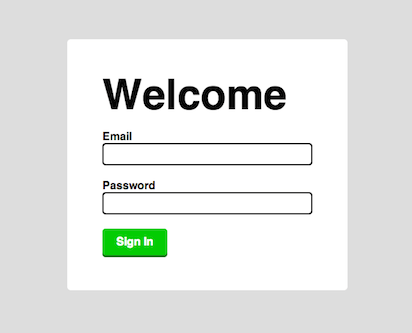
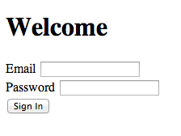
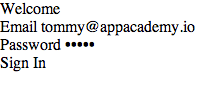
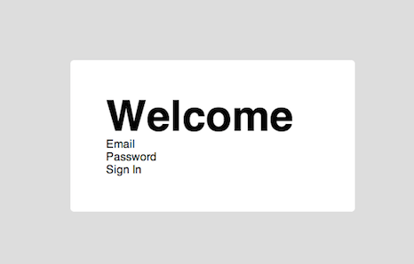
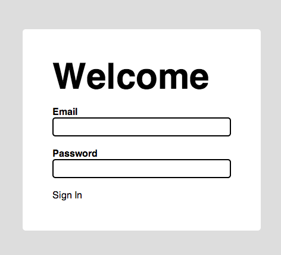
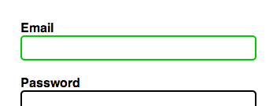
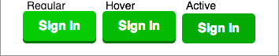

# Styling forms

In this demo, we're going to style a form. Much of the styling
decisions we made throughout the examples are based on our tastes,
however, we do follow a core UI/UX principle of giving the user
adequate feedback as they interact with the HTML.

We're going to make a basic sign-in form. We want it to look like this:



## Resets

By default, the user agent stylesheet makes text inputs and submit
inputs (buttons) disgusting.

Our HTML looks like this:

```html
<form class="sign-in-form">
  <h1>Welcome</h1>

  <div class="input">
    <label for="user-email">Email</label>
    <input type="email" name="user[email]" id="user-email" value="">
  </div>

  <div class="input">
    <label for="user-password">Password</label>
    <input type="password" name="user[password]" id="user-password" value="">
  </div>

  <div class="submit">
    <input type="submit" value="Sign In">
  </div>

</form>
```

which looks like this in OS X:



As you can see, the inputs have styling that we don't want. The text inputs
have the border that looks like the actual element is recessed into the page
and OS X tries to make the submit button look like its native buttons.

Let's strip everything:

```css
html, body, h1, form, label, div {
  margin: 0;
  padding: 0;
  border: 0;
  font: inherit;
}

input[type="email"],
input[type="password"],
input[type="text"],
input[type="submit"] {
  margin: 0;
  padding: 0;
  border: 0;
  outline: 0;
  font: inherit;
  background: transparent;
  color: inherit;
  -webkit-appearance: none;
  box-sizing: content-box;
  width: auto;
  display: inline-block;
}

input[type="submit"] {
  cursor: pointer;
}
```

Looks like this:



Now we have no styles at all. I typed my email and password in because
if not, there's no visual cue that there even is a text input there.

# Let the styling begin

First we'll add general styles, like this:

```css
body {
  font-family: sans-serif;
  padding: 100px 0;
  background: #ddd;
}

.sign-in-form {
  width: 300px;
  padding: 50px;
  background: white;
  margin: auto;
  border-radius: 5px;
}

.sign-in-form > h1 {
  font-weight: bold;
  font-size: 60px;
  line-height: 1.0;
}
```



## Text input field

Let's style the text input with the nice border:

```css
.input {
  margin: 20px 0;
}

.input > label {
  display: block;
  font-weight: bold;
}

.input > input {
  display: block;
  border: 2px solid black;
  padding: 5px;
  width: 286px;
  border-radius: 5px;
}
```



Notice how the labels (email and password) now expand to 100% of their
parent (the form), forcing the input to the next line. This is because
we gave the `label`s `display: block;`.

Also, see how we gave the `input`s `width: 286px;`, even though the
`form` is 300px wide? If we were to also give the `input`s 300px, then
they'd actually expand past the `form` on the right edge, because we also
have padding and borders, adding 7px on each side (300 - 7 - 7 = 286px).

However, if you ever change the `form`'s width, but still want the text
`input`s to take up 100% of the width of the `form`, then you'd have to
remember to change their width too. Enter `box-sizing`:

### `box-sizing`

The `box-sizing` property specifies how the size of an element should be
calculated. By default, the size is calculated based on the content, so, if you
specify that a block element should have:

```css
width: 100px;
height: 100px;
padding: 5px;
border: 5px;
```

then, the size of the element (100 x 100px) will be the area where the content
is allowed. The padding and border will be outside of this, so the actual
element will be 120 x 120px (10px on each side for padding and border). This is
known as `box-sizing: content-box;`, and it's the default.


There is, however, an option for the element to include the padding and border
inside of its own width an height. If we set `box-sizing: border-box;`, then
the whole element will be 100 x 100px, and the space for the content will be 90
x 90px.


Coming back to our text `input`s, we can use this property so that we
don't have to specify a specific width on them, but just say it should
be `width: 100%`. This will make it expand so that it expands until its
*border* is as big as its parent.

## Focus, you must!

When you focus (click) on an input to write in it, we should let the user know
that the input is focused and ready to receive the text. One way to do this is
by changing its border like this:



```css
.input > input:focus {
  border-color: #0c0;
}
```

## Submit button

In this same fashion, when the user hovers over the submit button, we want
there to be some visual feedback that says it's a button that they can click,
and the same thing when they actually press the button, like this:

```css
.submit > input {
  padding: 10px 20px;
  background: #0c0;
  color: #fff;
  box-shadow: 0 3px 0 0 #070;
  border-radius: 5px;
  font-weight: bold;
}

/* Give the user feedback when they hover over */
.submit > input:hover {
  background: #0b0;
}

/* Let them know that they're actually pressing the button */
.submit > input:active {
  top: 3px;
  box-shadow: none;
  background: #0a0;
}

/* To use top: 3px, we need to set it to position: relative also */
.submit > input {
  position: relative
}
```



Notice How when you hover, the button gets a little darker, and then when you
click (`active`), it loses the `box-shadow` and drops by the size of the
shadow, making it look like it's actually being pressed into the page.

## C'est fini!

Feel free to look at the [example code](./example.html)

