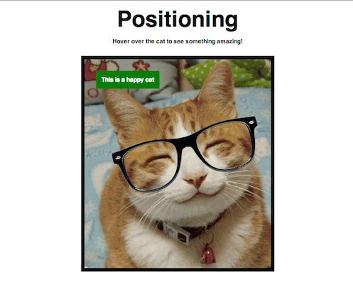
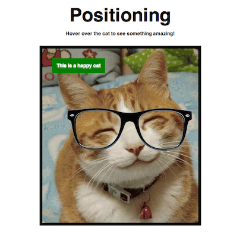
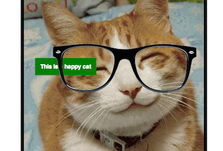

# Positioning demo. AKA "The Cat with Glasses"

This is what we want to build:



Of course, the glasses only show up when we hover over the cat, duh.

## Get everything in the HTML

Let's also add some basic CSS reset and general styling.

```html
<!DOCTYPE html>
<html>
  <head>
    <style>
    html, body, h1, p, figure, figcaption, img {
       margin: 0;
       padding: 0;
       border: 0;
       font: inherit;
     }

     body { font-family: sans-serif; }

     h1 {
       margin: 15px;
       font-weight: bold;
       font-size: 60px;
       text-align: center;
     }

     p {
       margin: 15px;
       text-align: center;
       font-weight: bold;
     }

     figure {
       margin: 30px auto;
       border: 10px solid black;
       width: 500px;
     }

     img {
       display: block;
       width: 100%;
       height: auto;
     }
    </style>
  </head>
  <body>
    <h1>Positioning</h1>

    <p>Hover over the cat to see something amazing!</p>

    <figure>

      <figcaption>This is a happy cat</figcaption>

      
      

    </figure>
  </body>
</html>
```

Ok, we're already close, but let's get the glasses on top of the cat.

## `position: absolute;`

We choose to make the glasses `position: absolute;` to lift it out of the
document flow, it doesn't take up space, and we can place it on top of the cat.
We also know we need to make the container, the `figure`, `position: relative;`
else as soon as we nudge the glasses, they'll be nudged relative to the window.

Let's also place the `figcaption` on top of the cat pic while we're at it, too.

```css
figure {
  position: relative;
}

.img-glasses {
  position: absolute;
  top: 190px;
  left: 80px;
  width: 400px;
}

figcaption {
  position: absolute;
  top: 30px;
  left: 30px;
  background: green;
  color: white;
  font-weight: bold;
  padding: 15px;
}
```



## Stack out of whack

Well now we've got a bunch of different element that we're nudging in the same
area. In this case, the cat picture is big enough so that the glasses and the
`figcaption` don't overlap. But what if we had a smaller cat? Then we might run
into trouble, like this:



The `figcaption` is behind the glasses because it appears before in the HTML.
But we don't want to depend on the order in which we write the HTML, right? No,
we don't. Not only because that could get really messy and hard to keep track
of, but also because we'd be making the HTML responsible for how our page
looks, which should be delegated to CSS.

Let's be explicit about it just in case.

```css
.img-cat {
  position: relative;
  z-index: 1;
}

figcaption {
  z-index: 2;
}

.img-glasses {
  z-index: 3;
}
```

Review `z-index` [here.](./../05-positioning/README.md#z-index)

## Lopsided glasses?

Almost done. Let's rotate the glasses.

```css
.img-glasses {
  -webkit-transform: rotate(-15deg);
}
```

Woah, what's that? The `-webkit-transform` property is a CSS3 property that
still isn't part of the CSS3 standard. However, all the modern browsers
implement it. The thing is that because it's still not part of the standard, we
have to specify that it's a property specific to the browser. That's what the
`-webkit` part is. For Firefox, we'd use `-moz` (for Mozilla), for Opera, `-o`, and for Internet Explorer, `-ms` (Microsort).

It's not uncommon to see all of these properties set, and one without the browser prefix for when the property does become part of the standard, like so:

```css
.img-glasses {
  -webkit-transform: rotate(-15deg);
  -moz-transform: rotate(-15deg);
  -o-transform: rotate(-15deg);
  -ms-transform: rotate(-15deg);
  transform: rotate(-15deg);
}
```


Voila!

## Glasses on `hover` only!

```css
.img-glasses {
  display: none;
}

figure:hover .img-glasses {
  display: block;
}
```

All done! Check out the [example code][example] from where I got all the
screen-shotted pictures. There's an example of tagging in there that I didn't
cover in here. See if you can figure it out how it works yourself!

[example]: ./cat-glasses.html
