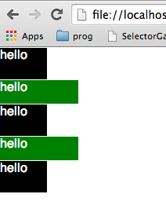
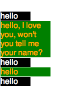
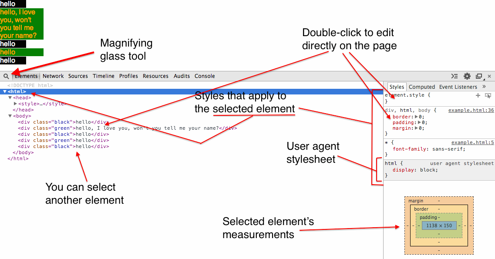

# Syntax
```html
<!DOCTYPE html>
<html>
  <head>
    <!-- In the HTML -->
    <style>
      selector {
        property: value;
        another-property: anothervalue;
      }
    </style>
    <!-- External stylesheet -->
    <link rel="stylesheet" type="text/css" href="/path/to/css/file.css"
  </head>
  <body>
  </body>
</html>
```

# Selectors

There are many different ways to select elements. You can use element IDs, classes, pseudo classes, and tag names.

Examples:

|          | HTML                            | CSS selector |
|:-------- |:------------------------------- |:------------:|
| ID       | `<div id="something"></div>`    | `#something` |
| class    | `<div class="something"></div>` | `.something` |
| tag name | `<div></div>`                   | `div`        |


## Selector precedence

Not all selectors are created equal. Some are more 'powerful' than others. Here's the order:

1. `!important`
  - `selector { property: value !important; }`
  - NB: This is not a selector. It only applies to a single property applied through a rule.
2. Inline styles
  - `<div style="property: value;"></div>`
3. IDs
  - `<div id="some-id"></div>`, then in CSS: `#some-id { property: value; }`
4. Classes (or pseudo classes)
  - `<div class="some-class"></div>`
  - Then, in CSS: `.some-class { property: value; }`
  - Pseudo-class: `input[type="submit"]`
5. Tag name
  - `<div></div>`
  - Then, in CSS: `div { property: value; }`

The `!important` flag should be used very sparsely. You most likely won't use it for a very long time. For the most part it's only used to overwrite the styles applied by some sort of plugin or widget. For example, Google's reCAPTCHA generates elements on the fly with inline styles. The only way we can overwrite these styles is with the `!important` flag. It should be reserved for those kinds of situations.

One of the main reasons CSS was invented was to separate out the decorative/ornamental rendering logic from actual content, so that rules out inline-styles. It also makes your styles much less dynamic and flexible. ie: having different styles for mobile devices and computer screens would be impossible.

We prefer to use classes for the most part, sprinkling in some pseudo-class and tag-name rules, and just apply different classes to apply styles.


## Specificity

- Selector chaining: Selectors can be chained to create more specific selectors.
  - For example `div.content` would select divs with class `content`. This is more specific than just specifying `.content`.
- Descendants: You can specify that a selector must be a descendant of another element.
  - `section.posts article.post` selects all the `article`s with class `post` that are descendants of any `section` with class `posts`.
  - This is more specific than just specifying `article.post`.
- Direct descentants: Specify that an element must be a direct descentant of another element.
  - i.e.: `#posts > article` selects all the `article` elements that are immediately nested under an element with ID `posts`.
  - This is more specific than `#posts article`

For exact specificity level, you can use a [specificity calculator][spec_calc]
[spec_calc]: http://specificity.keegan.st/

# Box model

HTML elements are all rectangles. We can specify their widths and heights explicitly if they are `block` elements. There are 4 boxes nested within each other. From inner-most to outer-most, we have: content, padding, border, and margin.

- Content: The `width` and `height` properties determine the size of the content box. As a reminder, if you don't specify a height and the element is a block, the height will grow to fit its contents.
- `padding` property specifies padding!
- `border`
- `margin`

### Example:
```css
div {
  width: 100px;
  height: 100px;
  padding: 30px;
  border: 30px;
  margin: 0 0 40px 0;
}
```

would give us:


*`margin: 0 0 40px 0;` is a short-hand way of specifying the following:
```css
margin-top: 0;
margin-right: 0;
margin-bottom: 40px;
marign-left: 0;
```
each number in `0 0 40px 0` corresponds to a side of the box. The order goes clockwise starting from the top side of the box.

Another short-hand way of specifying different measurements for each side is `margin: 0 40px;`, where `0` applies to the top and bottom, and `40px` to the left and right sides.


# User-agent Style Sheet

Browsers implement some default css rules for different elements. For example, an `h1` tag may have some margin by default. However, different browsers might implement different defaults. It is highly recommended to clear out these defaults for all the elements you use in order to have the same output across all browsers. For example,

```css
  div {
    margin: 0;
    padding: 0;
    border: 0;
    font: inherit;
  }
```

# Display property

The display property sets how an elements should be displayed. The most commonly used values are `none`, `block`, and `inline`.

- `none`: Removes the element from the page. It will not be displayed at all and will not take up space on the page.
- `block`: The element will expand to the full width of the parent container. It's height will be variable, to match the height of its contents.
  - By default, the element will be on the left side of its parent container. Any sibling elements that follow it will be stacked under it. It won't allow any  sibling elements next to it, on the same horizontal level, even if there is space.
  - Here is an example:

  

  - These are 5 divs. The black ones have `class="black"` and the green ones have `class="green"`. Notice how I don't specify a height. By default they grow vertically to the size of their contents, in this case 'hello', and they grow horizontally to the full width of their parent container, in this case `body`. Here's the CSS for this:

  ```css
    .black {
      background: black;
      color: white;
      margin: 1px;
    }

    .green {
      background: green;
      color: white;
      margin: 1px;
    }
  ```
  - I can also give them a specific width and height like so:

  ```css
    .black {
      background: black;
      color: white;
      margin: 1px;
      width: 60px;
      height: 40px;
    }

    .green {
      background: green;
      color: white;
      margin: 1px
      width: 100px;
      height: 30px;
    }
  ```
  which will give us 

  - However, if the content grows to a height larger than the height we set on its container, it will simply overflow (and look like crap), like this:
    
    (I changed the color of the text for the green divs for clarity)
  - For this reason, we usually refrain from giving elements a specific height. Instead, what we do, is only specify a width and let them grow vertically with their content. If we leave off the height in this example, we get this:

    

- `inline`: Meant to be used for elements that will be in-line, for example, words in paragraphs. Can't set height of these, but they can have a width and margin that will push everything on its same line away.
  - For example, a `strong` tag in a pragraph (`p` tag) is `inline`. i.e.:
  ```html
    <p>
      Lorem ipsum dolor sit amet, consectetur adipisicing elit, sed do
      eiusmod tempor incididunt ut labore et dolore magna aliqua. Ut enim
      ad minim veniam, quis nostrud <strong>exercitation</strong> ullamco
      laboris nisi ut aliquip ex ea commodo consequat. Duis aute irure dolor
      in reprehenderit in voluptate velit esse cillum dolore eu fugiat
      nulla pariatur.
    </p>
  ```
  - If we give the `strong` tag some width and padding (all-around padding), it will just push the words on its same line away, but it will not push the words above or below it. Take a look:
    

# Chrome's CSS inspector

Chrome comes with a very useful inspector. Open it by right-clicking on a page and clicking on 'Inspect Element', or command-option-i for the cool kids.

- Magnifying glass: Lets you select a DOM element on the page by clicking on it.
- View the styles that apply to the selected element on the right side
  - Scroll to the bottom to see that actual content, padding, border, and margin measurements.




