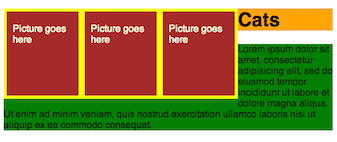
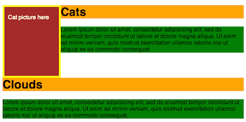
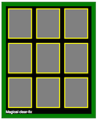

# Pseudo classes as selectors!

```css
input[type="submit"] { }
a:link { }
a:hover { }
a:visited { }
li:first-child { }  /* will select the first li. NOT its children */
li:nth-child(5) { }
li:nth-child(even) { }
```

# Pseudo-content

We can inject content into an element with CSS with the :before and :after
pseudo content selectors. This will inject a ☺ into every h1 tag, after any
content that is already inside of it.

```css
h1:after {
  content: "☺";
  display: block;
  color: red;
}
```


# Floats

The `float` property is used in layout design. To understand its purpose and
origin, we can look to print design. In a print layout, images may be set
into the page such that text wraps around them as needed.


In the same way, we can `float` elements in HTML so that other elements may
wrap around them. The floated elements will float next to each other
horizontally as long as there is space for them. When there isn't, they'll
move down to the next line.

Normally, if we had 3 block elements of a certain width and height, they'd stack
vertically like this:

From this:
```css
  div.picture {
    width: 100px;
    height: 100px;
    border: 5px solid yellow;
    background: brown;
    color: lightyellow;
    padding: 20px 10px ;
  }
```
we'd get this:


Then, we can apply `float: left;` to get this:


Now, the three pictures fit nicely next to each other. But what happens if the container can't fit them all on the same horizontal line? Check it out:


And what if we add text? Then we get this:



So, what's actually going on here? We have the three floated pictures. Then, the text, because it's `display: inline;` by default, it wraps the pictures. The text that fits next to the pics, goes there, and the rest keeps on flowing underneath them. However, the elements of the text, the `h1` and `p`
elements, actually expand behind the pics, even though their content, the actual text in this case, doesn't. Here, you'll be able to see it in this picture where I set `opacity: 0.6;` on the pictures.


Say we add another section of text that doesn't have much to do with the 'Cats' section. We wouldn't want it to wrap around the cat pics, even if there is room. We'd like it to start afresh underneath. However, if there is room for it to wrap around the pics, it will. How can we make it not do that? Enter the `clear` property.

### `clear`

Normally, if we have a 'Clouds' text section after the wrapping 'Cats' section,
it will also wrap. But in this case that obviously doesn't make any sense
because the picture is about cats:


For this, we'll use the `clear` property with value `left`, `right`, or `both`.
This clears the content to the side you specify. Content will not be allowed on
the side you specify and any content that follows, that would normally wrap
around, will be forced to be on a new line. Lets apply `clear: both;` to the
'Clouds' `h1` tag. This won't let it wrap next to the picture and will force it
to be on its own line.



## Photo gallery

Our cat website has gained some traction and we now have a bunch of cats we
need to display. Let's use this knowledge about floating elements next to each other to make a photo gallery.

We'll have a bunch of elements floating next to each other and we'll put them
all in one container like this:

```html
<head>
  <style>
  .picture {
    background: gray;
    border: 5px solid yellow;
    width: 100px;
    height: 130px;
    margin: 10px;
    float: left;
  }

  .pics {
    width: 390px;
    background: black;
    border: 10px solid green;
  }
  </style>
</head>
<body>

  <section class="pics">
    <div class="picture"></div>
    <div class="picture"></div>
    <!-- ... 9 of these -->
  </section>
</body>
```


AH!! What happened?? The pictures look like they're displayed the way we want,
but the `.pics` container, that has the green border and should be
`background: black;` isn't actually containing anything! It looks like it's
empty and just has a border around empty content, with the width we specified
on it, but no height. So, when we floated the pics, they lost their height. As
far as the container is concerned, it doesn't have any content. So, what do
we do? We want to have that container's background and border framing our
pictures.

Think about what happens then, if we put a `block` element inside of the container and set it to `clear: both;`, after all the floated elements. Take a look:

```html
<style>
.clearer {
  clear: both;
  color: white;
}
</style>
...
<section class="pics">
  <div class="picture"></div>
  <div class="picture"></div>
  <!-- ... 9 of these -->
  <div class="clearer">Magical clear-fix</div>
</section>
```

This gives us:



The container expands all the way to actually contain all the pics! This is because the div at the end, which clears elements in both directions, will be after all the pics, on it's own separate horizontal line. And, because it's not floated, the container does consider it part of its contents, effectively expanding the container to surround it. The `clear` property of the `div` is what causes this, which is why this solution is called a 'clear-fix'.

The `clear` property accepts 4 different values: `both`, `none`, `left`, and `right`. By default, it's set to `both` on non-floated block elements. This means it will clear all content to `both` of its sides. No elements will be allowed on the same horizontal line as it, they'll be pushed down to the next line. `clear: right;` wouldn't allow any elements on its right side. You get the picture.

The problem is that putting a div inside every container element of floated elements isn't DRY. How can we generalize this? Think about it for a second (hint: it involves injecting some `after` pseudo content somewhere).

The DRY solution is to inject some `after` content into the container element (that will go after all the floated elements it contains), and set it to `display: block;`, `clear: both;`, and `content: "";`.

Now, we just have to apply the `group` class to the container elements. The class is typically called 'clear-fix' or 'group'. I prefer 'group' because it has more semantic meaning, stating that the container is a 'group' of floated elements.

```html
<style>
.group:after {
  clear: both;
  content: "";
  display: block;
}
</style>
...
<section class="pics group">
  <div class="picture"></div>
  <div class="picture"></div>
  <!-- ... 9 of these ... -->
</section>
```


