# Navigation Bar

This is more of a review of everything we've covered so far. The only new part
is `margin: auto;`. Do a command+f for 'auto' to find it if that's all you're
looking for.

Step by step, we'll be building this:

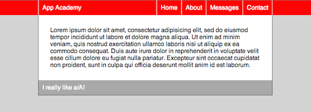

## HTML

First, take a look at the HTML and then I'll explain why I picked these tags.

```html
<body>
  <header>

    <nav class="group">
      <h1>
        App Academy
      </h1>

      <ul>
        <li><a href="#">Home</a></li>
        <li><a href="#">About</a></li>
        <li><a href="#">Messages</a></li>
        <li><a href="#">Contact</a></li>
      </ul>
    </nav>

  </header>

  <main>
    <section>
      <p>
        Lorem ipsum dolor sit amet, consectetur adipisicing elit, sed do
        eiusmod tempor incididunt ut labore et dolore magna aliqua. Ut enim ad
        minim veniam, quis nostrud exercitation ullamco laboris nisi ut aliquip
        ex ea commodo consequat. Duis aute irure dolor in reprehenderit in
        voluptate velit esse cillum dolore eu fugiat nulla pariatur. Excepteur
        sint occaecat cupidatat non proident, sunt in culpa qui officia
        deserunt mollit anim id est laborum.
      </p>
    </section>

    <footer>
      I really like a/A!
    </footer>
  </main>
</body>
```

Every tag is selected for its semantic meaning. So, the whole red bar at the
top is the `header` tag. Everything else is in the `main` tag. Inside the
`header`, we have a `nav` tag which contains all the navigation links. The logo,
being important, is in an `h1` tag, while the list of links to the left is in a
`ul`, saying it actually is a list. The main content is in a `main` tag, and
the footer is in a `footer`.

For a more detailed reference about the context and semantic meaning of each tag,
check out [WHATWG's explanation](http://simon.html5.org/html-elements).

So, let's get started.

## Getting Started

The HTML alone looks like this:

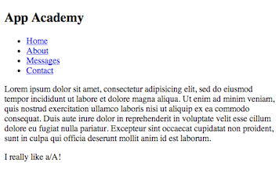


Let's add a general reset and change the ugly font:

```css
html, body, header, nav, ul, li, h1, main, section, p, footer, a {
  margin: 0;
  padding: 0;
  border: 0;
  font: inherit;
}

body { font-family: sans-serif; }
```

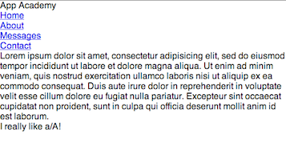

## Header

Let's start by making the header red and making sure it expands to the width of
the window.

```css
header {
  color: red;
  width: 100%;
  display: block;
}
```

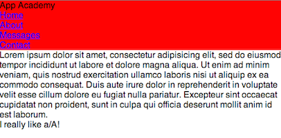

### Float things

Then, lets float things. We'll float the logo to the left and the `ul` to the
right. Inside of the `ul`, we'll float the `li`s to the left so they're all on
the same line. Don't forget to add the clearfix to the `nav` as now all of
its children are floated!

```css
h1 {
  float: left;
}

ul {
  float: right;
}

li {
  float: left;
}

```

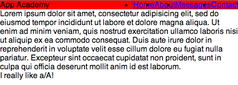

### Prettify

Let's remove the bullets for the `li`s and give them a little padding so
they're not so clumped up. And `color: white;`

```css
h1 {
  color: white;
}

ul {
  list-style: none;
}

li {
  padding: 10px;
}

a {
  text-decoration: none;
  color: white;
}
```

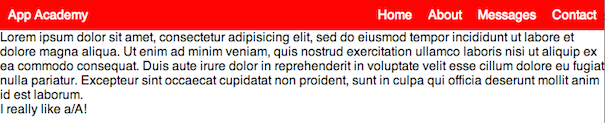

### Center the nav

Looks good, but the `nav` element is expanding to the full width of the `header`.
We want it to center horizontally. We do this by giving it a specific width and
setting its horizontal `margin` to `auto`. The specific width makes sense
because if not, it'll just expand to the width of its parent, so there won't
be any margin on either side for it to center. `margin: 0 auto;` says it should
have 0 margin on the top and bottom and `auto` margin on the left and right
sides, which will just split up whatever space there is into the left and right
margins.

NB: `auto` only works for centering an element horizontally, not vertically.

```css
nav {
  width: 700px;
  margin: 0 auto;
}
```

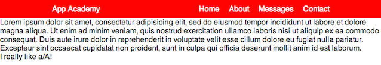

Let's give it some borders so you see what's actually going on:

```css
nav {
  border-right: 1px solid white;
  border-left: 1px solid white;
}

li {
  border-right: 1px solid white;
}
```

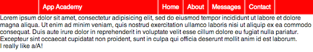

The whole `nav` is contained by the left and right-most white borders. We
also put a border on the left side of each `li`.

NB: We didn't have to put a border on the right side of the last `li` because
it's already bordered by the right border on the `nav`. #twobirdsoneborder

### User feedback - `a:hover`

Let's give users feedback when they hover over links. This will make it more
obvious that they can click on them. Let's make it so the background darkens
a little bit, and the text is underlined.

```css
a:hover {
  text-decoration: underline;
  background: darkred;
}
```

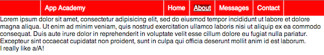

Ah!! We're close. But when we hover over a link, it only colors the actual text
(I can't screen-shot with my mouse on the link, so make believe it's on the
'About' link. I forced element state via the elements tab on the Chrome inspector).
That's because the `a` only is the size of the text. The `li` takes up the rest
of the space within the borders. Right now, I have to click directly on the
text for the link to work. Design-wise it makes more sense to be able to click
anywhere within the borders, that's what a user would expect. That will also
make the `darkred` area when we hover over the link expand to the full size
between the borders. To do this, we first have to make the `a` a block element
and give it padding. We'll get rid of the padding on the `li`s then, else we'd
double the padding.

```css
a {
  display: block;
  padding: 10px;
}

li {
  /* padding: 10px; */
}
```

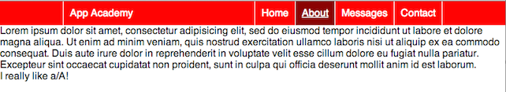

Much, much nicer! And now I can click anywhere within the borders to follow
the link.

## `main` Content

Let's prettify this. This should be easy for you by now:

```css
body {
  background: lightgray;
}

main {
  width: 700px;
  margin: 0 auto 50px auto; /* clock-wise starting from the top */
  border: 1px solid black;
  border-top: 0
}

section {
  background: white;
  padding: 30px;
}
```

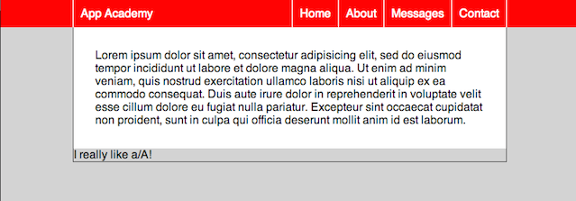

It's coming along! Now the footer:

```css
footer {
  color: white;
  background: darkgray;
  padding: 10px;
}
```


All done!!
