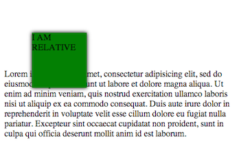
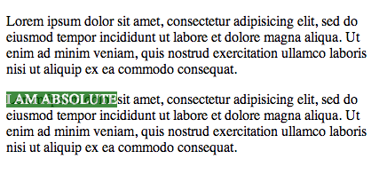
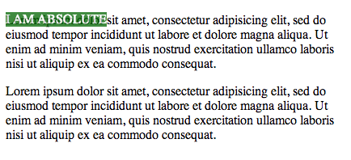
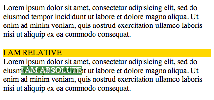
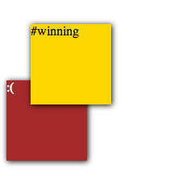

# Positioning & Document flow

The document flow is how the elements appear on the page. For the most part,
they show up one after the other in the order they appear in the HTML. As
we've already seen, we can change this a little with floats. But what if we
want complete control over the appearance, regarless of what the flow says?

Enter the `position` property. This will give us different ways to control
the.. um.. position of an element.

## `position: static;`

This is the default for all elements. It will take up its normal space and
appear in its default place in the document flow. Cannot be 'nudged'
somewhere else.

## `position: relative;`
- Creates a new coordinate system for children that are "absolute"

These behave just like `static` elements by default. It takes up the same space
on the document and shows up in the same spot as if it were static, however,
it gives us access to a few more properties we can use to nudge it.

Nudging moves an element `relative` to its default position. Relative elements
give us access to their `left`, `right`, `top`, and `bottom` properties to
nudge them. The `left` property moves it to the left relative to its original
position and `top`, relative to its default top position. Notice that we can
set these to negative values, which is the reason you'll mostly only see the
`top` and `left` properties used in real life.

Example:

```html
<head>
  <style>
  div {
    background: green;
    position: relative;
    top: 50px;
    left: 50px;
    width: 100px;
    height: 100px;
    box-shadow: 0 0 10px #000;
  }
  </style>
</head>
<body>
  <div class="relative">I AM RELATIVE</div>
  <p>
    Lorem ipsum dolor sit amet, consectetur adipisicing elit, sed do eiusmod tempor incididunt ut labore et dolore magna aliqua. Ut enim ad minim veniam, quis nostrud exercitation ullamco laboris nisi ut aliquip ex ea commodo consequat.
  </p>
</body>
```



As you can see, the green div is nudged from the top left (where it would
normally be). The space where it would normally be is preserved as if it were
still there, and it moves over the `p` of text.


## `position: absolute;`

Like `relative` elements, by default, `absolute` elements show up where they
normally would. However, contrary to `relative`, they DO NOT take up space in
the document flow. They're lifted out of the flow.

Nudging these is also a little different. You use the same properties to nudge,
however, the new position will be `absolute` relative to its first non-static
parent container. If none is found, it will be absolute relative to the `body`.

Let's see this in examples. Let's start by setting a `div` to
`position: absolute;`:

```html
<head>
  <style>
    .absolute {
      position: absolute;
      background: darkgreen;
      color: white;
      opacity: 0.7;
    }
  </style>
</head>
<body>
  <p>
    Lorem ipsum dolor sit amet, consectetur adipisicing elit, sed do eiusmod tempor incididunt ut labore et dolore magna aliqua. Ut enim ad minim veniam, quis nostrud exercitation ullamco laboris nisi ut aliquip ex ea commodo consequat.
  </p>

  <div class="absolute">
    I AM ABSOLUTE
  </div>

  <p>
    Lorem ipsum dolor sit amet, consectetur adipisicing elit, sed do eiusmod tempor incididunt ut labore et dolore magna aliqua. Ut enim ad minim veniam, quis nostrud exercitation ullamco laboris nisi ut aliquip ex ea commodo consequat.
  </p>
</body>
```



At first glance it looks just like a floated div, with the `p` wrapping around it, but look closely. The `div` is actually over the text. I lowered the opacity so you might be able to see it. The `div` actually doesn't take up space on the document flow.

OK, now that we have that, let's nudge it down a little bit so that it's actually above the second line of text in the second paragraph. Let's say that's about 15px from the `top` of where it is now?

```css
.absolute {
  top: 15px;
}
```



Oh NOO!! What happened? We just nudged it down 15px but it went all the way to the top of the screen! So, what actually happened is that when you nudge a `position: absolute;` element, it's new position will be relative to its first non-`static` parent. In this case, the `div` is top-level in the `body`, so what we actually did was position it 15px from the top of the `body`.

So how do we put it where we want it to be? We'll have to put it inside a non-static element, like so:

```html
<head>
  <style>
    p, div {
      padding: 0;
      margin: 0;
      border: 0;
    }

    .absolute {
      position: absolute;
      background: darkgreen;
      color: white;
      opacity: 0.7;
      top: 35px;
      left: 35px;
    }

    .relative {
      position: relative;
      background: gold;
      margin-top: 20px;
    }
  </style>
</head>
<body>
  <p>
    Lorem ipsum dolor sit amet, consectetur adipisicing elit, sed do eiusmod tempor incididunt ut labore et dolore magna aliqua. Ut enim ad minim veniam, quis nostrud exercitation ullamco laboris nisi ut aliquip ex ea commodo consequat.
  </p>

  <div class="relative">
    I AM RELATIVE
    <div class="absolute">
      I AM ABSOLUTE
    </div>
  </div>

  <p>
    Lorem ipsum dolor sit amet, consectetur adipisicing elit, sed do eiusmod tempor incididunt ut labore et dolore magna aliqua. Ut enim ad minim veniam, quis nostrud exercitation ullamco laboris nisi ut aliquip ex ea commodo consequat.
  </p>
</body>
```



Perfect! That's what we wanted. You may be thinking, "that's stupid, I can just
make the green div `position: relative;` and nudge it without setting up a
stupid container!", and you'd be right. This isn't the best example, but it
shows you the theory. In real life, you'd use this when you want the `absolute`
element to be positioned relative to it's container, not relative to something
else on the page. We'll do a demo showing when this becomes (very) useful.

## `position: fixed;`

Last but not least, you have `fixed`. The biggest difference with these is that
they remain `fixed` in place. They DO NOT move with the rest of the page when
you scroll. Like `absolute`, by default it shows up where it normally would in
the document flow, and it also does not take up space (lifted out). Other
elements will go behind it. Offset coordinates (nudging) are relative to the
window viewport (not the document). Watch out! Because you can place it fixed
outside of the window, never to be seen again!

## `z-index`

Since we can move elements relative to their default position in the document
flow, it's very possible they may end up on top of each other. Which one will
be on top?? By default the one that's declared later in the HTML will be on
top. What if we want different behavior? Turns out we can modify it with the
`z-index` property.

The `z-index` specifies the stack order of elements. All elements of position
`relative`, `absolute`, and `fixed` can have a `z-index` property. This makes
sense because they're the only ones that can be moved around and may end up on
top of something else.

The `z-index` is a number. The browser will compare this number for the
different elements and place the one with the bigger number on top. By default,
everything has a `z-index` of 0. So, you can be tricksy and give it a negative
number to put it behind the document.

```html
<head>
  <style>
    div {
      width: 100px;
      height: 100px;
      box-shadow: 1px 1px 10px #000;
      position: relative;

    }

    .top {
      z-index: 2;
      left: 30px;
      top: 30px;
      background: gold;
    }

    .bottom {
      z-index: 1;
      background: brown;
      color: white;
    }
  </style>
</head>
<body>
  <div class="top">#winning</div>
  <div class="bottom">wah</div>
</body>
```



NB: Nesting DOES matter. If you put an element with `z-index: 100;` nested in
another element of `z-index: -100;`, it will not show up on top of everything because its parent is still be behind everything.