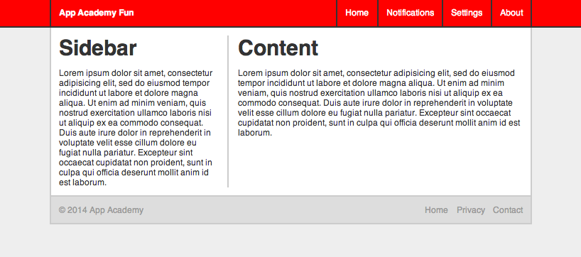
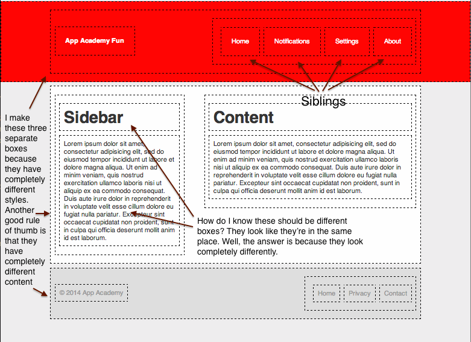

# CSS Layout

Making a whole layout in CSS can seem like a daunting task. However, we can
split it up into a series of steps, none if which is particularly hard:

0. Dissect your layout into rectangles
0. Make a html skeleton
0. Write out your css selectors
0. Write a css reset
0. Write your css utilities
0. Add cleafix .group classes to your html
0. Add floats
0. Then add general styling, top down

Our goal is to create this:



## 1. Dissect your layout into rectangles

Draw out the layout (paper is best) and break it down into rectangles. Each
rectangle represents a DOM element. Then, think of grouping rectangles
together. These grouped rectangles will represent sibling or ancestor elements.
A group of rectangles itself will be a rectangle.



## 2. Make an HTML skeleton

Try to be as semantic as possible with the tags you pick. You can find the
semantic meaning of each tag [here](http://simon.html5.org/html-elements). For
the most part you'll have one tag for every rectangle you drew out. Don't think
about styling AT ALL yet.

This is what I came up with:

```html
<header class="header">
  <nav class="group">
    <h1 class="header-logo">
      <a href="#">App Academy Fun</a>
    </h1>

    <ul class="header-ul group">
      <li><a href="#">Home</a></li>
      <li><a href="#">Notifications</a></li>
      <li><a href="#">Settings</a></li>
      <li><a href="#">About</a></li>
    </ul>
  </nav>
</header>

<main class="main group">
  <section class="main-sidebar">
    <h1>Sidebar</h1>
    <p>Lorem ipsum...</p>
  </section>

  <section class="main-content">
    <h1>Content</h1>
    <p>Lorem ipsum...</p>
  </section>
</main>

<footer class="footer group">
  <small>2014 App Academy</small>

  <ul class="group">
    <li><a href="#">Home</a></li>
    <li><a href="#">Privacy</a></li>
    <li><a href="#">Contact</a></li>
  </ul>
</footer>
```

## 3. Write out your CSS selectors

For now just write all the selectors for all the elements you have on the page
and just leave them empty. Don't add CSS yet. As a page grows, you might forget
what elements you actually put in there. Writing out the selectors for
everything you have in the order they show up on the page will help you
remember what to style and you won't wake up in a cold sweat in the middle of
the night because you remembered a rogue tag you forgot to add CSS rules for.

```css
.header {}
.header > nav {}
.header-logo {}
.header-logo > a {}
.header-logo > a:hover {}
.header-ul {}
.header-ul > li {}
.header-ul > li > a {}
.header-ul > li > a:hover {}
.main {}
.main-sidebar {}
.main-content {}
.main h1 {}
.main p {}
.footer {}
.footer > small {}
.footer > ul {}
.footer > ul > li {}
.footer > ul > li > a {}
.footer > ul > li > a:hover {}
```

## 4. Write a CSS reset

```css
html, body, header, main, footer, nav, h1, a, ul, li, section, p, small {
  margin: 0;
  padding: 0;
  border: 0;
  font: inherit;
}

ul {
  list-style: none;
}
```

## 5. Write your CSS utilities

```css
.group:after {
  content: "";
  display: block;
  clear: both;
}
```

## 6. Add floats and clearfix `.group` class to your html

```html
<head>
  <style>
    .header-logo { float: left; }
    .header-ul { float: right; }
    .header-ul > li { float: left; }
    .main-sidebar { float: left; }
    .main-content { float: right; }
    .footer > small { float: left; }
    .footer > ul { float: right; }
    .footer > ul > li { float: left; }
  </style>
</head>
<body>
  <header class="header">
    <nav class="group">
      <h1 class="header-logo">...</h1>

      <ul class="header-ul group">...</ul>
    </nav>
  </header>

  <main class="main group">
    <section class="main-sidebar">
      <h1>Sidebar</h1>
      <p>Lorem ipsum ...</p>
    </section>

    <section class="main-content">
      <h1>Content</h1>
      <p>Lorem ipsum ...</p>
    </section>
  </main>

  <footer class="footer group">
    <small>&copy; 2014 App Academy</small>
    <ul class="group">...</ul>
  </footer>
</body>
```

[*Revisit clearfix*](./../03-floats_and_pseudo_content/README.md#photo-gallery)

## Add general styling, top-down

You can see the finished HTML [here.](./example.html)