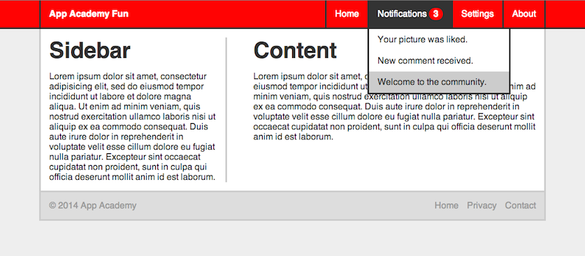
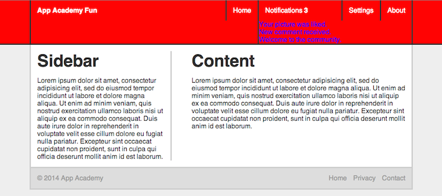
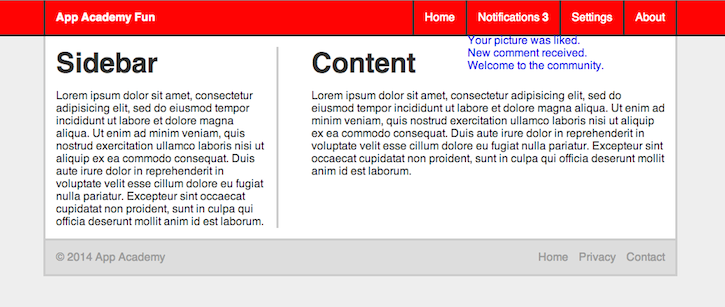
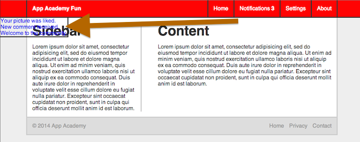
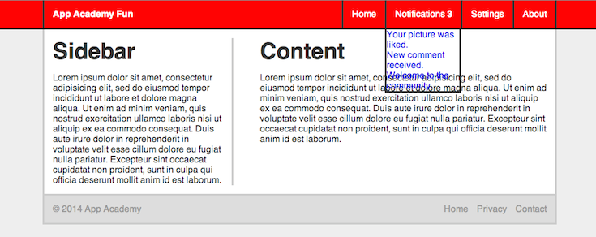

# Drop Down

Let's build a drop-down menu! We'll be building on top of the page we put
together in [this lecture](../06-layout/README.md).

We want the finished product to look like this:



The notifications navbar menu item is dropping down and changing color on
hover. The items in the dropdown turn gray when we hover over them. We also
have a little badge with the number of notifications wrapped in a circle that
changes background color when the notifications `li` changes background color
on hover

## Add the dropdown list

```html
...

<ul class="header-ul group">
  <li><a href="#">Home</a></li>
  <li>
    <a href="#">Notifications <strong class="header-badge">3</strong></a>
    <ul class="header-dropdown">
      <li><a href="#">Your picture was liked.</a></li>
      <li><a href="#">New comment received.</a></li>
      <li><a href="#">Welcome to the community.</a></li>
    </ul>
  </li>
  <li><a href="#">Settings</a></li>
  <li><a href="#">About</a></li>
</ul>

...

```

Nothing Fancy, but right now, it looks like this:



## `position`

We want it so that the dropdown only shows up when we hover over the
notifications `li` and that when it does show, that it doesn't take up any
space. It should just show up on top of any elements that may be in the way
instead of pushing them around. Based on this alone, our two positioning
options are `absolute` and `fixed`. The other requirement for the element's
position is that we need to be able to align it with the notifications `li`
(its parent). In this case, we need `absolute` because `fixed` would only allow
us to position it relative to the window. [Review absolute positioning here.](./05-positioning/README.md#position-absolute)
Let's also give it a super high z-index white we're at it so we guarantee it's
always on top of anything else we may have on the page. And let's also add the
border.

```css
.header-dropdown {
  position: absolute;
  z-index: 1000;
  border: 3px solid #333;
}
```



Pretty close already! But my anal self will NEVER accept the border of the
dropdown not aligning with the border for the notifications `li`. Let's use our
knowledge of `position: absolute;` to nudge it left just a little:

```css
.header-dropdown {
  left: -3px; /* the thickness of the border */
}
```



What?! Why??? Well.. turns out that when you nudge an `absolute` element, you
nudge it *relative to its first non-`static` parent.* This guy has no
non-`static` parents, so we just nudged it relative to the `body`. In this
case, we just apply `position: relative;` to the dropdown's parent. I'm just
going to apply it to all the `li`s in the navbar.

[Review `position: relative;` here](./05-positioning/README.md#position-relative)

```css
.header_ul > li {
  position: relative;
}
```



Ah, much better! But why are our links in the dropdown wrapping? Actually, the
whole `ul`'s width shrunk. It shrunk to the width of its parent. Remember that
even though it doesn't look like it's inside of it, now that we set its parent
container to `relative`, the element actually is, and by default, block
elements expand their width to the size of their container. So, let's just make
the dropdown a little wider.

```css
.header-dropdown {
  width: 250px;
}
```

## Add general styles

```css
.header-dropdown {
  display: none;
}

li:hover .header-dropdown {
  display: block;
}

.header-dropdown > li {
  display: block;
  background: white;
}

.header-dropdown > li > a {
  display: block;
  padding: 10px 15px;
  color: #333;
}

.header-dropdown > li > a:hover {
  background: #ccc;
}
```

## Badge

This one's pretty simple.

```css
.header-badge {
  display: inline;
  background: #333;
  padding: 2px 8px;
  border-radius: 50%;
}

li:hover .header-badge {
  background: #f00;
}
```

We give it a padding for it to be a circle. It would be an elipse if not. We
make it a circle by kind of hacking the `border-radius` property. It's usually
used to give elements rounded corners, but if you give it a value of at least
50% of its own size, then it will end up being a circle.

### [Play around with the HTML and CSS yourself][example]
[example]: ./example.html
