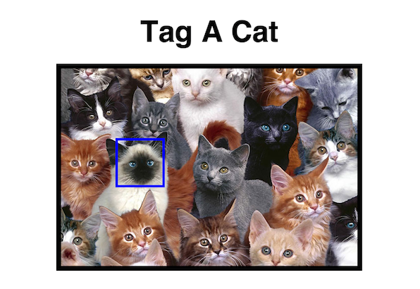
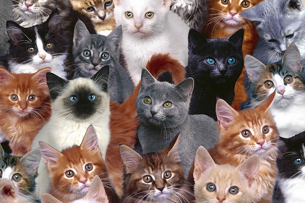
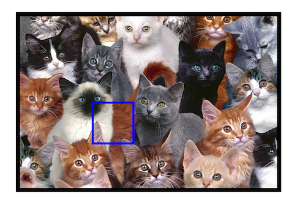

# Picture Tagging

Let's implement picture tagging. This is the goal:



## Overview

We'll have one HTML element that wraps the actual picture and the tagging
square. The tagging square will be hidden by default, and on click on the photo, we'll display it and change the CSS to place it where we clicked.

## HTML

```html
<h1>Tag A Cat</h1>

<figure class="photo">
  <div class="tag"></div>
  
</figure>
```

Simple. We have a title, then it's just a `figure` that wraps the `.tag` square
and the actual image.

## Add general styles

Add all the general styling for everything except the tagging box. There's no
new material in this section, it should all be review.

```css
html, body, div, figure, h1 {
  /*
    Reset the tags on the page to prevent any
    default browser styles.
  */
  margin: 0;
  padding: 0;
  border: 0;
  font: inherit;
}

body {
  font-family: sans-serif;
  background: #fff;
  color: #000;
}

h1 {
  margin: 30px 0;
  text-align: center;
  font-weight: bold;
  font-size: 60px;
}

.photo {
  /*
    Margin auto for left and right margin properties align
    it in the center.
  */
  margin: 30px auto;

  width: 600px;
  border: 10px solid black;
  background: #888;

  /*
    Hide any part of the children that stick out beyond the borders
    of this .photo box. This may or may not be desired, but looks
    good in this demo.
  */
  overflow: hidden;

  /*
    A crosshair is _so much_ better.
  */
  cursor: crosshair;
}

.photo > img {
  /*
    Make the image a block (rather than the default of inline)
    to prevent line-height spacing at the bottom of the image.
    Comment this out to see the difference.
  */
  display: block;

  /*
    Stretch the image to fill the parent container (.photo). The
    height is set to auto to grow it proportionally.
  */
  width: 100%;
  height: auto;
}
```

## Tagging square

We'll want the tagging square to be blue, transparent background, and hidden
by default. We'll also want it to be on top of the picture and not take up any
space on the document flow, so we'll make it `position: absolute;`, which will
require us to make the `.photo` container `position: relative;`. Check out the
[positioning demo](../09-positioning-demo/README.md) or the
[intro to positioning lecture](../05-positioning/README.md#position-absolute)
if you need a refresher on that.

Lastly, we'll add a class to the `.photo` container of 'is-tagged' in order to
display the tagging square.

```css
.photo {
  position: relative;
}

.tag {
  /* Regular styling, the full size will be 100 x 100. */
  width: 90px;
  height: 90px;
  border: 5px solid blue;
  background: transparent;

  position: absolute;

  /* Hide by default. */
  display: none;

  /*
    You can give it an offset if you want, but these are
    the properties you'll be overwriting with javascript
    on click so that it pops up where you clicked.
  */
  top: 0;
  left: 0;

  /*
    Put it on top. Although by default as the only absolutely
    positioned element it should already be on top, but be explicit.
  */
  z-index: 1;
}

.is-tagged > .tag {
  display: block;
}
```

## Add some JS

Let's add the JS for when we click. Adding the tagging square (`.tag`)
onto the picture involves two steps:
  1. We add the `.is-tagged` class to the `.photo` container to show the tagging square.
  2. We nudge the `.tag` element to where we clicked, relative to it's `.photo` container.

There is one gotcha that you should pay attention to, or it WILL come back to
bite you, hard. We have two ways of nudging the `.tag` element to where we
clicked: we can use the exact pixel number of where we clicked, or we can give
it a percentage of the parent. Let's suppose we decide to go with pixels
because we use pixels for most other things in our CSS and we're simply more
comfortable with them. Then, a year down the line, we're heavily funded, and
through a focus group we find out that our pictures are a tad small and people
are squinting to see the details. We want to make the pictures 50px wider
(allowing them to expand in height proportionally). What's going to happen to
all our taggings (which positions we stored in the exact pixel offset from the
top and left of the picture)? They're going to be totally off. Storing them as
percentage offsets will allow us to resize the picture as much as we want.

```html
<script src="jquery.js"></script>

<script>
$(document).ready(function() {

  $(".photo").on("click", function(event) {

    var $photo = $(this);
    var $tag = $photo.find(".tag");

    $photo.addClass("is-tagged");

    var x = ((event.pageX - $photo.offset().left) / $photo.outerWidth()) * 100;
    var y = ((event.pageY - $photo.offset().top) / $photo.outerHeight()) * 100;

    $tag.css({
      "left": x + "%",
      "top": y + "%"
    });

  });

});
</script>
```

`event.pageX` and `event.pageY` is where we clicked, in pixels, relative to
the  top and left of the page. `$photo.offset()` is a jQuery function that
returns an object that has the distance (in pixels) to the top and left of
the page, like this: `{ top: 200, left: 200 }`. We divide by the `$photo`'s
width and height to get a percentage.

When we click we get this:



### Problems

I clicked on the center of the Siamese cat's face! (the one with white body but dark face and ears). What happened? The corner of the box is where I clicked, but the actual box isnt centered on the cat's face! That's because when we alter the `$tag` box's `left` and `top` properties with the percentage of where we clicked in the photo, we're specifying where its top-left corner should be.

## Center the `$tag` on the face!

So how can we nudge the `$tag` box over so ti's centered where we clicked?
We know we need to shift it left and up by half of its width and height, respectively.

The naive approach would be to factor this in to the percentages we're working with in the javascript, doing something like this:

```javascript
var x = ((event.pageX - $photo.offset().left - 50) / $photo.outerWidth()) * 100;
var y = ((event.pageY - $photo.offset().top - 50) / $photo.outerHeight()) * 100;
```

We know that the width and height of the `$tag` are both 100px, so we'd just
have to subtract 50px from the `top` and `left` when we're calculating the
percentages. Although this would work, we're introducing a code smell. If we
ever change the size of the `$tag` box (in some CSS file somewhere), we have to
somehow remember to also change this bit we added into the javascript.

Much better than this would be to just add that into our CSS. But how? Anything
we put in the `left` and `top` properties is going to be overwritten by our
javascript! Ah, but we won't change those. Attention you pay, young padawan:

```css
.tag {
  margin-top: -50px;
  margin-left: -50px;
}
```

This way, the code to nudge the box to be centered where we click is in the
same place as the code for its size, so if we ever change one, it'll be easier
to notice we also have to change the other.

#### C'est fini!

Feel free to check out the finished HTML [here](./tag.html).
