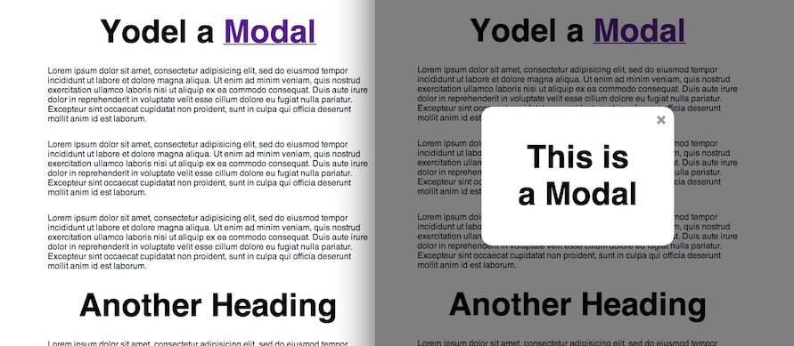
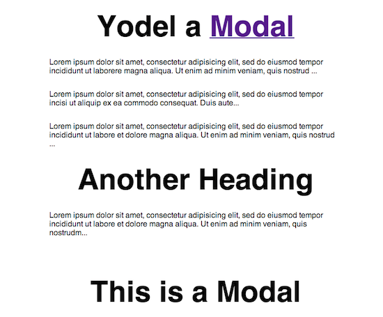

# Modal

This demo will guide you through making a modal, which is when some content
pops up and the rest of the page darkens. The intent is for you to focus
on the content in the modal.

This is what it should look like when it's finished. The screen starts off
looking like it does on the left, then, when you click on the 'Modal' link on
the top title, it'll look like the right side.



## The plan

We know that there has to be some element somewhere in our markup (the modal)
that will be hidden until we want to display it. The modal should display some
content in the middle of the page that demands all your focus. This can be done
by covering everything else on the page with a veil and only showing the modal.
In most cases, the vail is dark but also a little see-through.

When we display the modal, the user should be able to close it by either
clicking on a little 'X' on the top right of the modal, or by clicking
away, so anywhere on the page except the modal.

## HTML

The basic HTML structure should look like this:

```html
<body>
  <h1>Yodel a <a href="#">Modal</a></h1>

  <p>[content here]</p>
  <p>[content here]</p>
  <p>[content here]</p>

  <h1>Another Heading</h1>

  <p>[more content here]</p>

  <section id="modal" class="modal is-active">
    <article class="modal-content">
      <span class="modal-x">&times;</span>
      <h1>This is a Modal</h1>
    </article>
    <div class="modal-veil"></div>
  </section>
</body>
```

We have a link in the top `h1`, which is the link users will hit to open
up the modal. The `&times;` will make an 'X' when it's rendered by the
browser (it's actually a multiplication sign, which is a nicer 'X').
That'll be the button to close the modal.

Inside the `.modal`, we have the `.modal-veil`. This will be the element
that shows up in *between* the rest of the page and the modal, putting
the rest of the page in the background and bring the modal to the forefront
of your attention.

Notice how the `.modal` is top-level inside the `body`. This is on purpose.
You might think about nesting it deeper into your HTML if it's content
somehow more closely related to some content that's more deply nested in
your HTML, but that might break the CSS. We'll see why in a bit, but for
now, just keep in mind that that putting it top-level in the body was a
conscious decision.

## Basic styling

```css
/* RESET */
html, body, h1, p, div, section, article {
  margin: 0;
  padding: 0;
  border: 0;
  font: inherit;
}

body {
  font-family: sans-serif;
}

/* GENERAL STYLES */
h1 {
  margin: 30px;
  text-align: center;
  font-size: 60px;
  font-weight: bold;
}

p {
  margin: 30px auto;
  max-width: 600px;
}
```



## Modal styling

So far, our modal looks like it's just another heading in the document, so let's style it.

The modal whould be in the middle of the screen and not push any elements around it. Then, to put it in the center of the screen. We have two elements in the modal: the `.modal-content` and the `.modal-veil`. `.modal-content` is the one that we'll put in the center of the page.

```css
.modal-content {
  position: absolute;

  /* TOP LEFT CORNER WILL BE IN CENTER */
  top: 50%;
  left: 50%;

  width: 300px;
  min-height: 200px;
  padding: 30px;

  /* SHIFT UP AND LEFT BY HALF ITS SIZE */
  margin-left: -180px;
  margin-top: -130px;

  background: #fff;
  border-radius: 20px;

  /* MAKE SURE IT'S ON TOP OF EVERYTHING */
  z-index: 1000;
}

.modal-x {
  display: block;
  position: absolute;
  top: 5px;
  right: 15px;
  font-size: 30px;
  font-weight: bold;
  cursor: pointer;
  color: #999;
}

.modal-x:hover {
  color: #000;
}

```

Finally, lets hide it by default and only show it when it has the 'is-active' class.

```css
.modal {
  display: none;
}

.modal.is-active {
  display: block;
}
```


## Add some JS


