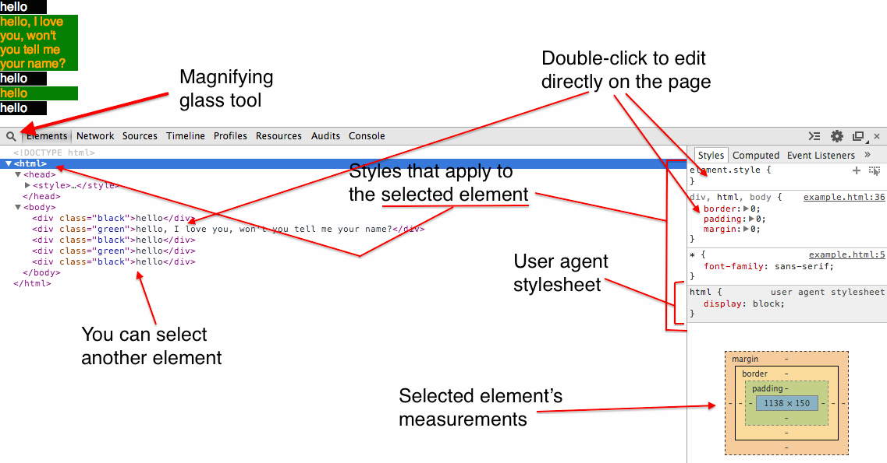

# Chrome's CSS inspector

Chrome comes with a very useful inspector. Open it by right-clicking on a page and clicking on 'Inspect Element', or command-option-i for the cool kids.

- Magnifying glass: Lets you select a DOM element on the page by clicking on it.
- View the styles that apply to the selected element on the right side
  - Scroll to the bottom to see that actual content, padding, border, and margin measurements.

