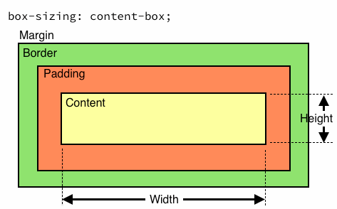
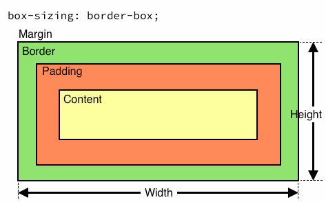

# Box model

HTML elements are all rectangles. We can specify their widths and
heights explicitly if they are `block` elements. There are 4 boxes
nested within each other. From inner-most to outer-most, we have:
content, padding, border, and margin.

- Content: The `width` and `height` properties determine the size of the content box. As a reminder, if you don't specify a height and the element is a block, the height will grow to fit its contents.
- `padding` property specifies padding!
- `border`
- `margin`

### Example:

```css
div {
  width: 100px;
  height: 100px;
  padding: 30px;
  border: 30px;
  margin: 0 0 40px 0;
}
```

would give us:


*`margin: 0 0 40px 0;` is a short-hand way of specifying the following:

```css
margin-top: 0;
margin-right: 0;
margin-bottom: 40px;
marign-left: 0;
```
each number in `0 0 40px 0` corresponds to a side of the box. The order goes clockwise starting from the top side of the box.

Another short-hand way of specifying different measurements for each
side is `margin: 0 40px;`, where `0` applies to the top and bottom,
and `40px` to the left and right sides.

As a demo, open up your inspector in chrome, and navigate to the "Elements" tab. Right click the `head` tag, and click "Edit as HTML". Then, add the following lines:

```html
<style>
  * {
    border: 1px solid red;
  }
</style>
```

To see borders around every box on the page!

## Advanced: `box-sizing`

The `box-sizing` property specifies how the size of an element should be
calculated. By default, the size is calculated based on the content, so, if you
specify that a block element should have:

```css
width: 100px;
height: 100px;
padding: 5px;
border: 5px;
```

then, the size of the element (100 x 100px) will be the area where the content
is allowed. The padding and border will be outside of this, so the actual
element will be 120 x 120px (10px on each side for padding and border). This is
known as `box-sizing: content-box;`, and it's the default.



There is, however, an option for the element to include the padding and border
inside of its own width an height. If we set `box-sizing: border-box;`, then
the whole element will be 100 x 100px, and the space for the content will be 90
x 90px.



Coming back to our text `input`s, we can use this property so that we
don't have to specify a specific width on them, but just say it should
be `width: 100%`. This will make it expand so that it expands until its
*border* is as big as its parent.