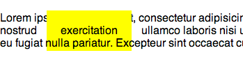

# Document Flow

The document flow is how the elements appear on the page. For the most part,
they show up one after the other in the order they appear in the HTML.

Take this example:

The yellow box is the background of the 'exercitation' word. You can see that
it goes on top of the text of the previous line, but behind the next line.
This is because 'exercitation' comes after the previous line, and the next
line comes after 'exercitation' in the HTML.

One way to remember this is as if the browser it 'tiling' the page starting
from the top. Each element can be considered a tile. The browser starts
laying the tiles down on the page from the top of the HTML and works its
way down. So, subsequent tiles get laid last, so they might land on top
of tiles that were already on the page.