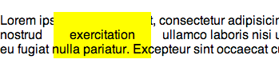

# Display property

The display property sets how an elements should be displayed. The two most commonly used types are 'inline' and 'block', however, we also have 'none' and 'inline-block' that are more adequate in very specific cases.

## `display: none;`

Removes the element from the page. It will not be displayed at all and will
not take up space on the page. Note that the element is still in the DOM,
and viewable from the source of the page, it just isn't rendered.

This produces:

<br><br><br><br><br><br>

That's a joke.

## `display: block;`

The element will expand to the full width of the parent container. It's height will be variable, to match the height of its contents.

  - By default, the element will be on the left side of its parent container. Any sibling elements that follow it will be stacked under it. It won't allow any  sibling elements next to it, on the same horizontal level, even if there is space.
  - Here is an example:

  

  - These are 5 divs. The black ones have `class="black"` and the green ones have `class="green"`. Notice how I don't specify a height. By default they grow vertically to the size of their contents, in this case 'hello', and they grow horizontally to the full width of their parent container, in this case `body`. Here's the CSS for this:

  ```css
    .black {
      background: black;
      color: white;
      margin: 1px;
    }

    .green {
      background: green;
      color: white;
      margin: 1px;
    }
  ```

  - I can also give them a specific width and height like so:

  ```css
    .black {
      background: black;
      color: white;
      margin: 1px;
      width: 60px;
      height: 40px;
    }

    .green {
      background: green;
      color: white;
      margin: 1px
      width: 100px;
      height: 30px;
    }
  ```

  which will give us:

  

  - However, if the content grows to a height larger than the height we set on its container, it will simply overflow (and look like crap), like this:
    
    (I changed the color of the text for the green divs for clarity)
  - For this reason, we usually refrain from giving elements a specific height. Instead, what we do, is only specify a width and let them grow vertically with their content. If we leave off the height in this example, we get this:

    

### Demo

Check out this [positioning demo][positioning_demo]
([code][positioning_demo_code]). Note the use of `display: none` to hide the
cat's glasses until the user hovers over the picture:

```css
.img-glasses {
  display: none;
  ...
}

figure:hover .img-glasses {
  display: block;
}
```

**Note:** The `display: block;` wins out on `:hover` because it's more specific than the general `.img-glasses` rule. Review this [here](./05-selector_precedence/README.md) if it's not clear.

[positioning_demo]: http://appacademy.github.io/css-demos/positioning.html
[positioning_demo_code]: https://github.com/appacademy/css-demos/blob/gh-pages/positioning.html

## `display: inline;`

Meant to be used for elements that will be in-line, for example, words
in paragraphs. Can't set height of these, but they can have a width and
margin that will push everything on its same line away.

  - For example, a `strong` tag in a pragraph (`p` tag) is `inline`. i.e.:

  ```html
    <p>
      Lorem ipsum dolor sit amet, consectetur adipisicing elit, sed do
      eiusmod tempor incididunt ut labore et dolore magna aliqua. Ut enim
      ad minim veniam, quis nostrud <strong>exercitation</strong> ullamco
      laboris nisi ut aliquip ex ea commodo consequat. Duis aute irure dolor
      in reprehenderit in voluptate velit esse cillum dolore eu fugiat
      nulla pariatur.
    </p>
  ```

  - If we give the `strong` tag some width and padding (all-around padding), it will just push the words on its same line away, but it will not push the words above or below it. Take a look:

    

### Demo

Check out this [form demo][form_demo] ([code][form_demo_code]). Notice how the
CSS sets the inputs to `display: block` to override their default `inline-block`
behavior:

```css
.input > input {
  display: block;
  ...
}
```

This gives each text input its own line, growing to the width of its container.

[form_demo]: http://appacademy.github.io/css-demos/form.html
[form_demo_code]: https://github.com/appacademy/css-demos/blob/gh-pages/form.html

## `display: inline-block;`

Inline block elements are a combination of the block and inline elements (shocking!). They do remain inline, but they force elements around them to respect both horizontal and vertical space. Basically, they behave like inline elements to their neighboring elements, but behave like blocks internally.

```html
/* CSS */
strong {
  background: yellow;
  width: 100px;
  height: 50px;
  display: inline-block;
}

/* HTML */
Lorem ipsum dolor sit <strong>amet, consectetur</strong> adipisicing elit, sed do eiusmod tempor incididunt...
```

This produces:


### Demo

Check out this [centering demo][center_demo] ([code][center_demo_code]). Note
the use of `display: inline-block` to make the `<ul>` respect its parent's
use of `text-align: center`:

```css
header {
  text-align: center;
}

ul {
  display: inline-block;
  ...
}
```

[center_demo]: http://appacademy.github.io/css-demos/center.html
[center_demo_code]: https://github.com/appacademy/css-demos/blob/gh-pages/center.html

