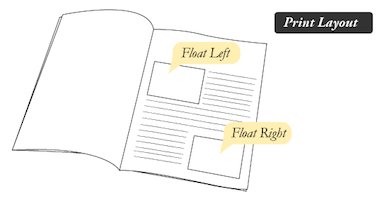
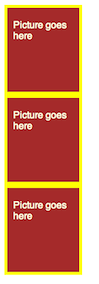
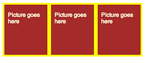
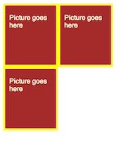
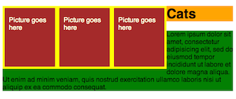
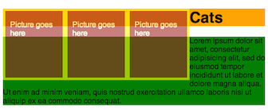
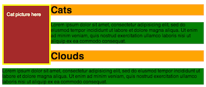
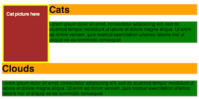

# Floats

The `float` property is used in layout design. To understand its purpose and
origin, we can look to print design. In a print layout, images may be set
into the page such that text wraps around them as needed.



In the same way, we can `float` elements in HTML so that other elements may
wrap around them. The floated elements will float next to each other
horizontally as long as there is space for them. When there isn't, they'll
move down to the next line.

Normally, if we had 3 block elements of a certain width and height, they'd stack
vertically like this:

From this:
```css
  div.picture {
    width: 100px;
    height: 100px;
    border: 5px solid yellow;
    background: brown;
    color: lightyellow;
    padding: 20px 10px ;
  }
```
we'd get this:




Then, we can apply `float: left;` to get this:



Now, the three pictures fit nicely next to each other. But what happens if the container can't fit them all on the same horizontal line? Check it out:



And what if we add text? Then we get this:



So, what's actually going on here? We have the three floated pictures. Then, the text, because it's `display: inline;` by default, it wraps the pictures. The text that fits next to the pics, goes there, and the rest keeps on flowing underneath them. However, the elements of the text, the `h1` and `p`
elements, actually expand behind the pics, even though their content, the actual text in this case, doesn't. Here, you'll be able to see it in this picture where I set `opacity: 0.6;` on the pictures.



Say we add another section of text that doesn't have much to do with the 'Cats' section. We wouldn't want it to wrap around the cat pics, even if there is room. We'd like it to start afresh underneath. However, if there is room for it to wrap around the pics, it will. How can we make it not do that? Enter the `clear` property.

### `clear`

Normally, if we have a 'Clouds' text section after the wrapping 'Cats' section,
it will also wrap. But in this case that obviously doesn't make any sense
because the picture is about cats:



For this, we'll use the `clear` property with value `left`, `right`, or `both`.
This clears the content to the side you specify. Content will not be allowed on
the side you specify and any content that follows, that would normally wrap
around, will be forced to be on a new line. Lets apply `clear: both;` to the
'Clouds' `h1` tag. This won't let it wrap next to the picture and will force it
to be on its own line.

