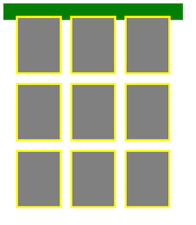
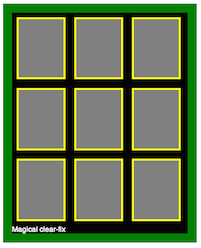
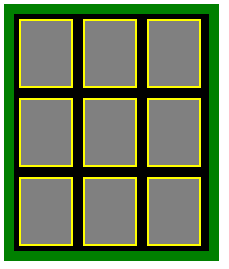

# Clearfix

Our cat website has gained some traction and we now have a bunch of cats we
need to display. Let's use our knowledge about floating elements next to each other to make a photo gallery.

We'll have a bunch of elements floating next to each other and we'll put them
all in one container like this:

```html
<head>
  <style>
  .picture {
    background: gray;
    border: 5px solid yellow;
    width: 100px;
    height: 130px;
    margin: 10px;
    float: left;
  }

  .pics {
    width: 390px;
    background: black;
    border: 10px solid green;
  }
  </style>
</head>
<body>

  <section class="pics">
    <div class="picture"></div>
    <div class="picture"></div>
    <!-- ... 9 of these -->
  </section>
</body>
```



AH!! What happened?? The pictures look like they're displayed the way we want,
but the `.pics` container, that has the green border and should be
`background: black;` isn't actually containing anything! It looks like it's
empty and just has a border around empty content, with the width we specified
on it, but no height. So, when we floated the pics, they lost their height. As
far as the container is concerned, it doesn't have any content. So, what do
we do? We want to have that container's background and border framing our
pictures.

Think about what happens then, if we put a `block` element inside of the
container and set it to `clear: both;`, after all the floated elements.
Take a look:

```html
<style>
.clearer {
  clear: both;
  color: white;
}
</style>
...
<section class="pics">
  <div class="picture"></div>
  <div class="picture"></div>
  <!-- ... 9 of these -->
  <div class="clearer">Magical clear-fix</div>
</section>
```

This gives us:



The container expands all the way to actually contain all the pics! This
is because the div at the end, which clears elements in both directions,
will be after all the pics, on it's own separate horizontal line. And,
because it's not floated, the container does consider it part of its
contents, effectively expanding the container to surround it. The `clear`
property of the `div` is what causes this, which is why this solution
is called a 'clear-fix'.

The `clear` property accepts 4 different values: `both`, `none`, `left`,
and `right`. By default, it's set to `both` on non-floated block elements.
This means it will clear all content to `both` of its sides. No elements
will be allowed on the same horizontal line as it, they'll be pushed down
to the next line. `clear: right;` wouldn't allow any elements on its right
side. You get the picture.

The problem is that putting a div inside every container element of floated
elements isn't DRY. How can we generalize this? Think about it for a second
(hint: it involves injecting some `after` pseudo content somewhere).

The DRY solution is to inject some `after` content into the container element
(that will go after all the floated elements it contains), and set it to
`display: block;`, `clear: both;`, and `content: "";`.

Now, we just have to apply the `group` class to the container elements. The
class is typically called 'clear-fix' or 'group'. I prefer 'group' because
it has more semantic meaning, stating that the container is a 'group' of
floated elements.

```html
<style>
.group:after {
  clear: both;
  content: "";
  display: block;
}
</style>
...
<section class="pics group">
  <div class="picture"></div>
  <div class="picture"></div>
  <!-- ... 9 of these ... -->
</section>
```

